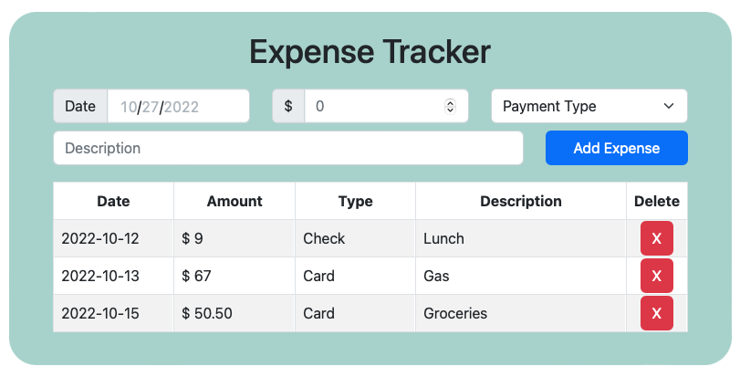

# React Expense Tracker

 

_This expense tracker is a simple example of how to use forms to populate a table using React, Javascript and Boostrap._

 

See it in action [here](https://nicks-expense-tracker.herokuapp.com).

 

Screenshot: 

## Summary

This project was my introduction to React. I was immediately intrigued by the syntax and how it played off of HTML's element style to create components. It was also interesting to learn an alternative to GET/POST to send/receive form data.

useState, setState and useEffect were all challenging concepts at first, but I caught on quickly and see just how useful they can be.

The form and table are assembled with Bootstrap components, which made it pretty quick to focus on the rest of this project.

I also learned how to use localstore for the first time.

Looking forward to working more with React...

## Author

-  **Nick Schaefer** - _Full-Stack Software Developer_ - [Website](https://nschaefer.com/) | [LinkedIn](https://www.linkedin.com/in/nick-n-schaefer)
